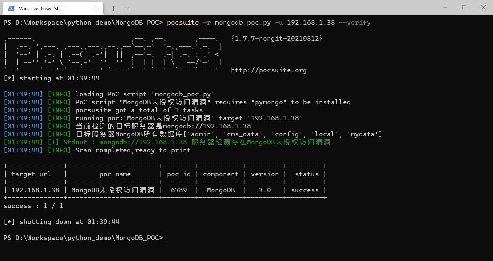
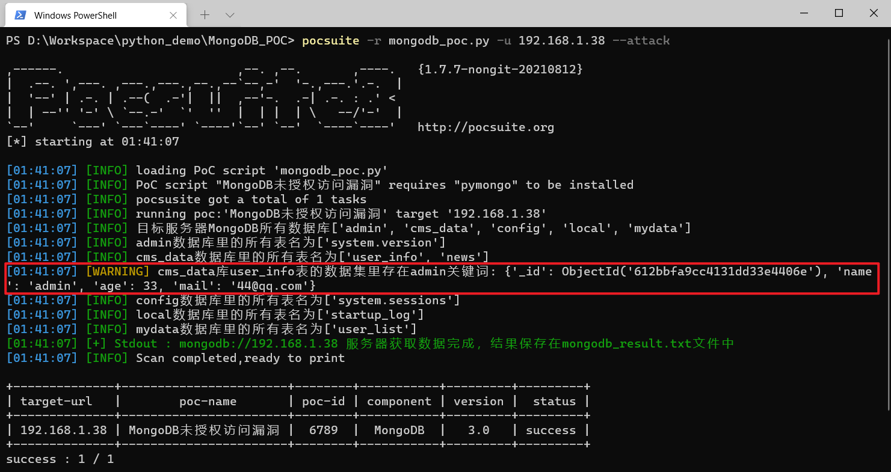
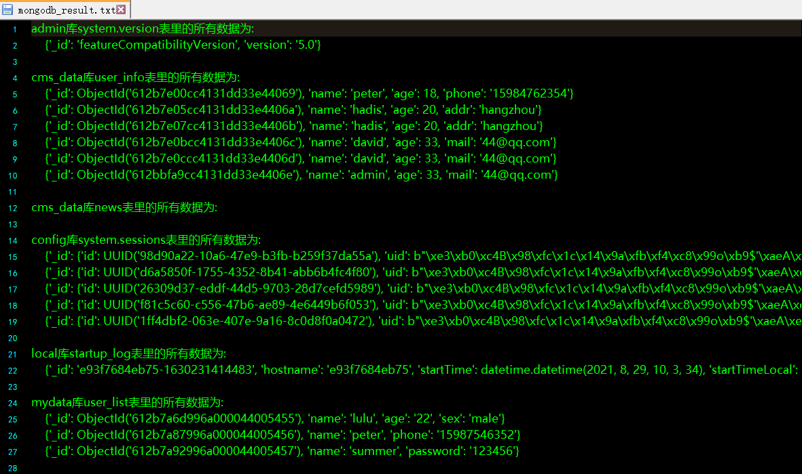

## 功能说明
* 本示例是对MongoDB未授权访问进行分析，使用python开发的可利用EXP
* 该POC对目标是否存在未授权访问进行精准判断，对目标库表进行获取，以Json结构进行显示，并且对存在admin关键词的表数据进行获取

---

## 使用方法
1. cd到MongoDB_POC项目根目录下
2. 安装依赖`pip3 install -r requirements.txt`
3. 检测漏洞`pocsuite -r mongodb_poc.py -u 192.168.1.38 --verify`
4. 获取admin`pocsuite -r mongodb_poc.py -u 192.168.1.38 --attack`
5. 查看attack攻击结果：MongoDB_POC/目录下的mongodb_result.txt文件中

---

## 检测漏洞示例
`pocsuite -r mongodb_poc.py -u 192.168.1.38 --verify`

---

## 获取admin示例

`pocsuite -r mongodb_poc.py -u 192.168.1.38 --attack`

---

## attack攻击结果

